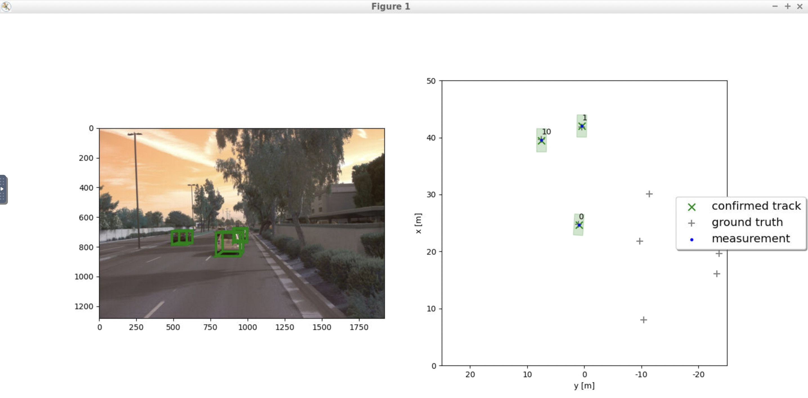

# Writeup: Sensor Fusion and Object Tracking

This is the project for the second course in the [Udacity Self-Driving Car Engineer Nanodegree Program](https://www.udacity.com/course/c-plus-plus-nanodegree--nd213) : Sensor Fusion and Tracking.

This final project is finished within the Udacity online-workspace VM.

The final project consists of four sections, as described in [project rubric](https://review.udacity.com/#!/rubrics/3006/view)

The following are the tasks completed:

- Building Kalman Filter system to track an object
- Object tracking and updating tracks (creating and deleting)
- Understanding the association between the data (sensor)
- Added camera sensor fusion based on lidar fusion

## Section 1: Implement an "EKF" to track a single real-world target

In this section, we track objects over time with a Kalman Filter
In the filter.py file, EKF is used.

- EKF is implemented including appropriate system matrix F and process noise Q for constant velocity motion model.
- EKF is applied to a simple single-target scenario with lidar only.
- The mean RMSE is 0.35 or smaller

  

The analysis of rmse with current time is shown in the below image (single tracking).

The initial tracking error is relatively significant because the initial estimation was not properly managed.

## Section 2: Implement the track management, then initialize and activate it.

Next, we proceed with the analysis of track management, where the tracklist is capable of accommodating multiple objects. Each object represents a track within the device architecture. The track and measurement details are then passed on to the Kalman filter, allowing for updates to be made to the specific worker associated with the track.
In the trackmanagement.py file:

- Track initialization from unassigned measurements is implemented.
- A track score is defined and implemented.
- Track states are defined and implemented, e.g. “tentative”, “confirmed”.
- Old tracks are deleted for not updated tracks.
- The tracking works properly if you see the following results: After applying the track management to a new sequence (see instructions), the visualization shows that a new track is initialized automatically where unassigned measurements occur, the true track is confirmed quickly, and the track is deleted after it has vanished from the visible range. There is one single track without track losses in between.

  

The analysis of rmse with current time is shown in the below image (single tracking).

## Section 3: Imlement a single nearest neighbor data association for multi-object tracking

During this stage, the nearest neighbor association accurately establishes connections between multiple measurements and corresponding tracks.
In the association.py.py file:

- Nearest neighbor data association including association matrix is implemented.
- A method that returns nearest track and measurement for association is implemented.
- Gating method with chi-square-distribution is implemented to reduce complexity.
- The association works properly if you see the following results: After applying the data association to a new sequence with multiple targets, multiple tracks are updated with multiple measurements. The console output shows that each measurement is used at most once and each track is updated at most once.
- The visualization should show that there are no confirmed “ghost tracks” that do not exist in reality. There may be initialized or tentative “ghost tracks” as long as they are deleted after several frames. Please upload the RMSE plot as png or pdf file.

## Section 4: implement the non-linear observation model with camera and complete the sensor fusion module for camera-lidar fusion!

Now we will be adding to the Kalman filter. SWBAT fuse measurements from lidar and camera

In the association.py.py file:

- Camera measurements including appropriate covariance matrix R are implemented.
- Nonlinear camera measurement model h(x) is implemented. The Jacobian H is given.
- A method that checks whether an object can be seen by the camera or is outside the field of view is implemented.
- The tracking works properly if you see the following results: The tracking loop now updates all tracks with lidar measurements, then with camera measurements. The console output shows lidar updates followed by camera updates.
- The visualization shows that the tracking performs well, again no confirmed ghost tracks or track losses should occur.

The final results can be obtained as follows:

1. Write a short recap of the four tracking steps and what you implemented there (filter, track management, association, camera fusion). Which results did you achieve? Which part of the project was most difficult for you to complete, and why?

# Summary

This repository contains the implementation of a tracking system, focusing on filter implementation, track management, association, and camera fusion. The achieved results and key aspects are summarized as follows:

- Filter

  - Utilized a simple kinematic model, considering the relationship between different classes in the implementation.
  - Acknowledged the complexity of real-world vehicle models, leading to the rational use of the extended Kalman filter.
  - Aimed for more accurate numerical results, which may require higher order discretization methods and a high-performance mathematical library.
  - Introduced the extended Kalman filter to account for non-linear model distortions caused by white noise, though it introduced some errors. Suggested considering the unscented Kalman filter as a potentially better alternative.

- Track Management

  - Recognized track initialization as a crucial aspect, requiring thoughtful data containers for new tracks.
  - Addressed challenges of determining false positives, handling appearance and disappearance of vehicles in the field of view.
  - Pursued a stable mechanism for confirming detected objects, removing tentative objects, and managing objects leaving the field of view.

- Association

  - Introduced an association matrix to manage matching problems, particularly interested in efficient implementation in an embedded system using C++ without memory reallocation.
  - Emphasized the importance of correct association decisions for assigning measurements to objects, as wrong associations impact estimation accuracy.
  - Highlighted the effectiveness of using the Mahalanobis distance heuristic (MDH) to solve the most likely match problem.

- Camera Fusion

  - Considered the core aspect of the course, focusing on leveraging the advantages of different sensors and expanding visibility.

  While the courses provided clear guidance on implementing the Extended Kalman Filter (EKF), track management, data association, and camera-lidar fusion, I encountered challenges when working on the camera measuring model. The process of projecting a 3D point onto a 2D plane involved complex transformations within the camera axis. However, by carefully examining the project's code, I was able to identify the issue and resolve it successfully.

  Additionally, the project required the use of pre-computed results. However, I noticed that the pre-computed result files did not match the specified load filenames in the "loop_over_dataset.py" file. To overcome this obstacle, I made adjustments to the filenames in the code to align them with the pre-computed results. The modified filenames are indicated in the relevant sections of the "loop_over_dataset.py" file.

2. Do you see any benefits in camera-lidar fusion compared to lidar-only tracking (in theory and in your concrete results)?

- The camera provides significant benefits in the recognition of traffic signs. Additionally, it offers increased opportunities to verify the tentative nature of a detected object, thanks to the availability of a larger volume of observation data.

3. Which challenges will a sensor fusion system face in real-life scenarios? Did you see any of these challenges in the project?

- Lidar can not recognized a trafffic sign while camera is not good at measuring the distance.

4. Can you think of ways to improve your tracking results in the future?

- The utilization of the UKF filter introduces a more reliable kinematic model and advanced track management strategy. This improves the accuracy and robustness of object motion estimation, while also optimizing track initialization, handling false positives, and managing object appearance and disappearance. The integration of these techniques enhances the overall reliability and performance of the tracking system.
